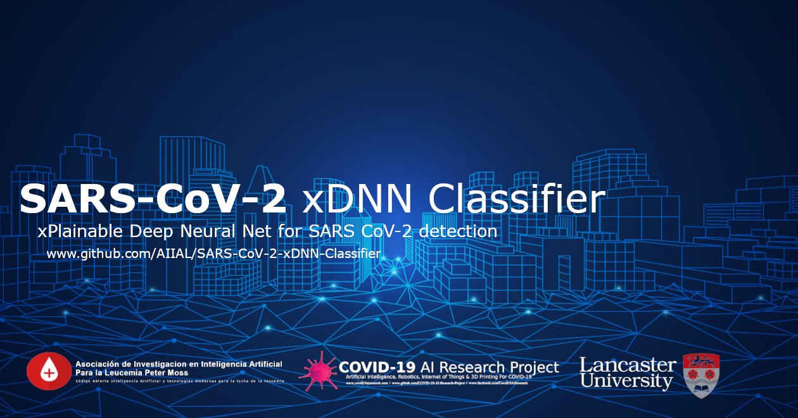

# Asociación de Investigacion en Inteligencia Artificial Para la Leucemia Peter Moss
## SARS-CoV-2 xDNN Classifier

     

&nbsp;

# Table Of Contents

- [Introduction](#introduction)
- [DISCLAIMER](#disclaimer)
- [Motivation](#motivation)
- [GETTING STARTED](#getting-started)
- [Contributing](#contributing)
  - [Contributors](#contributors)
- [Versioning](#versioning)
- [License](#license)
- [Bugs/Issues](#bugs-issues)

&nbsp;

# Introduction

The contamination by SARS-CoV-2 which causes the COVID-19 disease has generally spread everywhere throughout the world since the start of 2020. On January 30, 2020, the World Health Organization (WHO) proclaimed a worldwide health crisis. Analysts of various orders work alongside general health authorities to comprehend the SARS-CoV-2 pathogenesis and together with the policymakers direly create techniques to control the spread of this new disease.

Recent findings have observed imaging patterns on computed tomography (CT) for patients infected by SARS-CoV-2.

In this research, we have used a public available [SARS-COV-2 Ct-Scan Dataset](https://www.kaggle.com/plameneduardo/sarscov2-ctscan-dataset),
containing 1252 CT scans that are positive for SARS-CoV-2 infection (COVID-19) and 1230 CT scans for patients non-infected by SARS-CoV-2.
This dataset of CT scans for SARS-CoV-2 (COVID-19) identification is created by our collaborators, Plamenlancaster:
[Professor Plamen Angelov](https://www.lancaster.ac.uk/lira/people/#d.en.397371) from [Lancaster University](https://www.lancaster.ac.uk/)/
Centre Director @ [Lira](https://www.lancaster.ac.uk/lira/), & his researcher,
[Eduardo Soares PhD](https://www.lancaster.ac.uk/sci-tech/about-us/people/eduardo-almeida-soares).

The **SARS-CoV-2 xDNN Classifier** by Nitin Mane is an open-source implementation of an xPlainable Deep Neural Network (xDNN) classifier. Inspired by SARS-CoV-2 CT-scan dataset: A large dataset of real patients CT scans for SARS-CoV-2 identification by Eduardo Soares, Plamen Angelov, Sarah Biaso, Michele Higa Froes, Daniel Kanda Abe.

This project shows how eXplainable Deep Neural Networks can be used on the HIAS network to provide real-time SARS-CoV-2 classifications to HIAS applications and devices.

## xPlainable Deep Learning

The SARS-CoV-2 xDNN Classifier is based on the work of our collaborators, Plamenlancaster: [Professor Plamen Angelov](https://www.lancaster.ac.uk/lira/people/#d.en.397371) from [Lancaster University](https://www.lancaster.ac.uk/)/ Centre Director @ [Lira](https://www.lancaster.ac.uk/lira/), & his researcher,  [Eduardo Soares PhD](https://www.lancaster.ac.uk/sci-tech/about-us/people/eduardo-almeida-soares)

- [ELLIS Against COVID19 Youtube (Source)](https://www.youtube.com/watch?v=7RtDgGkxavc)
- [Facebook Video](https://www.facebook.com/covid19airesearch/videos/271817930672659)

### Paper
- Medrxiv: [SARS-CoV-2 CT-scan dataset: A large dataset of real patients CT scans for SARS-CoV-2 identification](https://www.medrxiv.org/content/10.1101/2020.04.24.20078584v3) - Eduardo Soares, Plamen Angelov, Sarah Biaso, Michele Higa Froes, Daniel Kanda Abe.

### Code
- Github: [Plamen-Eduardo / xDNN-SARS-CoV-2-CT-Scan](https://github.com/Plamen-Eduardo/xDNN-SARS-CoV-2-CT-Scan)

### Data
- Kaggle: [SARS-CoV-2 CT-scan dataset: A large dataset of real patients CT scans for SARS-CoV-2 (COVID-19) identification](https://www.kaggle.com/plameneduardo/sarscov2-ctscan-dataset)

&nbsp;

# Motivation

The motivation behind this project was to create an xPlainable Deep Neural Network based on the architectures proposed in SARS-CoV-2 CT-scan dataset: A large dataset of real patients CT scans for SARS-CoV-2 identification.

The goal is to see how xPlainable Deep Learning can be integrated into the HIAS network and provide real-time classifications for SARS-CoV-2.

&nbsp;

# DISCLAIMER

This project should be used for research purposes only. The purpose of the project is to show the potential of Artificial Intelligence for medical support systems such as diagnosis systems.

Although the classifier is accurate and shows good results both on paper and in real world testing, it is not meant to be an alternative to professional medical diagnosis.

Developers that have contributed to this repository have experience in using Artificial Intelligence for detecting certain types of cancer. They are not doctors, medical or cancer experts.

&nbsp;

# GETTING STARTED

Ready to get started ? Head over to the [Getting Started guide](documentation/getting-started.md) for instructions on how to download/install and setup the SARS=CoV-2 Classifier 2021.

&nbsp;

# Contributing
The Asociación de Investigacion en Inteligencia Artificial Para la Leucemia Peter Moss encourages and welcomes code contributions, bug fixes and enhancements from the Github community.

Please read the [CONTRIBUTING](CONTRIBUTING.md "CONTRIBUTING") document for a full guide to forking our repositories and submitting your pull requests. You will also find information about our code of conduct on this page.

## Contributors
- [Nitin Mane](https://www.leukemiaairesearch.com/association/volunteers/nitin-mane "Nitin Mane") - [Asociación de Investigacion en Inteligencia Artificial Para la Leucemia Peter Moss](https://www.leukemiaresearchassociation.ai "Asociación de Investigacion en Inteligencia Artificial Para la Leucemia Peter Moss") Deep Learning, Aurangabad, India

&nbsp;

# Versioning
We use SemVer for versioning.

&nbsp;

# License
This project is licensed under the **MIT License** - see the [LICENSE](LICENSE "LICENSE") file for details.

&nbsp;

# Bugs/Issues
We use the [repo issues](issues "repo issues") to track bugs and general requests related to using this project. See [CONTRIBUTING](CONTRIBUTING.md "CONTRIBUTING") for more info on how to submit bugs, feature requests and proposals.