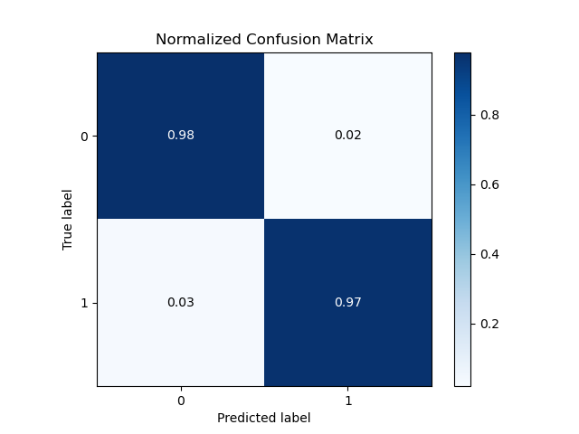

# Asociación de Investigacion en Inteligencia Artificial Para la Leucemia Peter Moss
## SARS-CoV-2 xDNN Classifier
### Getting Started


&nbsp;

# Table Of Contents

- [Introduction](#introduction)
    - [Network Architecture](#network-architecture)
- [Installation](#installation)
- [Data](#data)
	- [Application Testing Data](#application-testing-data)
- [Configuration](#configuration)
- [Training](#training)
    - [Metrics](#metrics)
	- [Start Training](#start-training)
	- [Training Data](#training-data)
	- [Model Summary](#model-summary)
	- [Training Results](#training-results)
	- [Metrics Overview](#metrics-overview)
	- [ALL-IDB Required Metrics](#all-idb-required-metrics)
- [Testing](#testing)
- [OpenVINO Intermediate Representation](#openvino-intermediate-representation)
- [HIAS UI](#hias-ui)
    - [NGINX](#nginx)
    - [Inference](#inference)
      - [Verification](#verification)
- [Contributing](#contributing)
  - [Contributors](#contributors)
- [Versioning](#versioning)
- [License](#license)
- [Bugs/Issues](#bugs-issues)

&nbsp;

# Introduction
This guide will guide you through the installation process for the SARS-CoV-2 xDNN Classifier.

## Network Architecture
You will build an xPlainable Deep Neural Network based on the proposed architecture in [SARS-CoV-2 CT-scan dataset: A large dataset of real patients CT scans for SARS-CoV-2 identification](https://www.medrxiv.org/content/10.1101/2020.04.24.20078584v3).

&nbsp;

# Installation
First you need to install the required software for training the model. Below are the available installation guides:

- [Ubuntu installation guide](installation/ubuntu.md) (Training).

&nbsp;

# Data
You need to download a copy of the Now Download the [SARS-CoV-2 CT Scan Dataset](https://www.kaggle.com/plameneduardo/sarscov2-ctscan-dataset) to use the SARS-CoV-2 xDNN Classifier.

Once you have your data you need to add it to the project filesystem. You will notice the data folder in the Model directory, **model/data**, inside you have **train** & **test**. Add all of the images from the **COVID** & **non-COVID** directories to the **model/data/train** directory.

## Application testing data

In the data processing stage, ten negative images and ten positive images are removed from the dataset and moved to the **model/data/test/** directory. This data is not seen by the network during the training process, and is used by applications.

To ensure your model gets the same results, please use the same test images. By default HIAS compatible projects will be expecting the same test images.  You can also try with your own image selection, however results may vary and you will need to make additional changes to our HIAS compatible projects.

To specify which test images to use modify the [configuration/config.json](../configuration/config.json) file as shown below:

```
"test_data": [
    "Covid (1128).png",
    "Covid (1183).png",
    "Covid (1239).png",
    "Covid (329).png",
    "Covid (371).png",
    "Covid (55).png",
    "Covid (552).png",
    "Covid (7).png",
    "Covid (842).png",
    "Covid (89).png",
    "Non-Covid (1114).png",
    "Non-Covid (1164).png",
    "Non-Covid (1205).png",
    "Non-Covid (217).png",
    "Non-Covid (457).png",
    "Non-Covid (56).png",
    "Non-Covid (6).png",
    "Non-Covid (715).png",
    "Non-Covid (822).png",
    "Non-Covid (955).png"
],
```

&nbsp;

# Configuration
[configuration/config.json](../configuration/config.json "configuration/config.json")  holds the configuration for our application.

- Change **agent->cores** to the number of cores you have on your training computer.
- Change **agent->server** to the local IP of your training device.
- Change **agent->port** to a different number.

<details><summary><b>View file contents</b></summary>
<p>

```
{
    "agent": {
        "cores": 8,
        "server": "",
        "port": 1234,
        "params": [
            "train",
            "classify",
            "server",
            "classify_http"
        ]
    },
    "data": {
        "dim": 224,
        "file_type": ".png",
        "labels": [0, 1],
        "test": "model/data/test",
        "test_data": [
            "Covid (1128).png",
            "Covid (1183).png",
            "Covid (1239).png",
            "Covid (329).png",
            "Covid (371).png",
            "Covid (55).png",
            "Covid (552).png",
            "Covid (7).png",
            "Covid (842).png",
            "Covid (89).png",
            "Non-Covid (1114).png",
            "Non-Covid (1164).png",
            "Non-Covid (1205).png",
            "Non-Covid (217).png",
            "Non-Covid (457).png",
            "Non-Covid (56).png",
            "Non-Covid (6).png",
            "Non-Covid (715).png",
            "Non-Covid (822).png",
            "Non-Covid (955).png"

        ],
        "train_dir": "model/data/train",
        "valid_types": [
            ".JPG",
            ".JPEG",
            ".PNG",
            ".GIF",
            ".jpg",
            ".jpeg",
            ".png",
            ".gif"
        ]
    },
    "model": {
        "features": "model/features",
        "x_feature": "model/features/data_df_X_train_lite.csv",
        "y_feature": "model/features/data_df_y_train_lite.csv"
    }
}
```

</p>
</details><br />

The configuration object contains 3 Json Objects (agent, data and model). Agent has the information used to set up your server, data has the configuration related to preparing the training and validation data and model holds the model file paths.

&nbsp;

# Training
Now you are ready to train your model.

## Metrics
We can use metrics to measure the effectiveness of our model. In this network you will use the following metrics:

- Accuracy
- Precision
- Recall
- AUC/ROC

These metrics will be displayed and plotted once our model is trained.

## Start Training
Ensuring you have completed all previous steps, you can start training using the following command.

```
python agent.py train
```

This tells the application to start training the model.

## Training Data
First the training and validation data will be prepared.

```
2021-05-14 01:44:46,888 - Agent - INFO - Negative data: 1219
2021-05-14 01:44:46,888 - Agent - INFO - Positive data: 1242
2021-05-14 01:44:46,888 - Agent - INFO - Batch: (2461, 4096)
2021-05-14 01:44:46,888 - Agent - INFO - Labels: (2461,)
2021-05-14 01:44:46,897 - Agent - INFO - Training data: (1968, 4096)
2021-05-14 01:44:46,897 - Agent - INFO - Training labels: (1968,)
2021-05-14 01:44:46,897 - Agent - INFO - Validation data: (493, 4096)
2021-05-14 01:44:46,898 - Agent - INFO - Validation labels: (493,)
2021-05-14 01:44:51,213 - Agent - INFO - Data preperation complete.
```

### Model Summary

Before the model begins training, you will be shown the model summary for the [VGG19 Model](https://github.com/keras-team/keras-applications/blob/master/keras_applications/vgg19.py) that is used for extracting features and data points.

```
2021-05-14 01:45:45,504 - Agent - INFO - X train: (1968, 4096)
2021-05-14 01:45:45,504 - Agent - INFO - Y train: (1968, 2)
2021-05-14 01:46:24,606 - Agent - INFO - Loaded xDNN Model.
Model: "model_1"
_________________________________________________________________
Layer (type)                 Output Shape              Param #
=================================================================
input_2 (InputLayer)         [(None, 224, 224, 3)]     0
_________________________________________________________________
block1_conv1 (Conv2D)        (None, 224, 224, 64)      1792
_________________________________________________________________
block1_conv2 (Conv2D)        (None, 224, 224, 64)      36928
_________________________________________________________________
block1_pool (MaxPooling2D)   (None, 112, 112, 64)      0
_________________________________________________________________
block2_conv1 (Conv2D)        (None, 112, 112, 128)     73856
_________________________________________________________________
block2_conv2 (Conv2D)        (None, 112, 112, 128)     147584
_________________________________________________________________
block2_pool (MaxPooling2D)   (None, 56, 56, 128)       0
_________________________________________________________________
block3_conv1 (Conv2D)        (None, 56, 56, 256)       295168
_________________________________________________________________
block3_conv2 (Conv2D)        (None, 56, 56, 256)       590080
_________________________________________________________________
block3_conv3 (Conv2D)        (None, 56, 56, 256)       590080
_________________________________________________________________
block3_conv4 (Conv2D)        (None, 56, 56, 256)       590080
_________________________________________________________________
block3_pool (MaxPooling2D)   (None, 28, 28, 256)       0
_________________________________________________________________
block4_conv1 (Conv2D)        (None, 28, 28, 512)       1180160
_________________________________________________________________
block4_conv2 (Conv2D)        (None, 28, 28, 512)       2359808
_________________________________________________________________
block4_conv3 (Conv2D)        (None, 28, 28, 512)       2359808
_________________________________________________________________
block4_conv4 (Conv2D)        (None, 28, 28, 512)       2359808
_________________________________________________________________
block4_pool (MaxPooling2D)   (None, 14, 14, 512)       0
_________________________________________________________________
block5_conv1 (Conv2D)        (None, 14, 14, 512)       2359808
_________________________________________________________________
block5_conv2 (Conv2D)        (None, 14, 14, 512)       2359808
_________________________________________________________________
block5_conv3 (Conv2D)        (None, 14, 14, 512)       2359808
_________________________________________________________________
block5_conv4 (Conv2D)        (None, 14, 14, 512)       2359808
_________________________________________________________________
block5_pool (MaxPooling2D)   (None, 7, 7, 512)         0
_________________________________________________________________
flatten (Flatten)            (None, 25088)             0
_________________________________________________________________
fc1 (Dense)                  (None, 4096)              102764544
_________________________________________________________________
fc2 (Dense)                  (None, 4096)              16781312
=================================================================
Total params: 139,570,240
Trainable params: 139,570,240
Non-trainable params: 0
_________________________________________________________________
2021-05-14 01:46:24,610 - Agent - INFO - VGG19 Model loaded

```

## Training Results
Below are the training results for 150 epochs.


_Fig 1. Accuracy_


_Fig 2. Precision, Recall and F1_



_Fig 3. Confusion Matrix_

```
2021-05-14 01:49:27,211 - Agent - INFO - ###################### Results ####################
2021-05-14 01:49:27,211 - Agent - INFO - Time: 138.88seconds
2021-05-14 01:49:27,211 - Agent - INFO - Accuracy: 0.9614604462474645
2021-05-14 01:49:27,212 - Agent - INFO - Precision: 0.9614604462474645
2021-05-14 01:49:27,213 - Agent - INFO - Recall: 0.9614604462474645
2021-05-14 01:49:27,214 - Agent - INFO - F1 score: 0.9614604462474645
2021-05-14 01:49:27,216 - Agent - INFO - Cohens kappa: 0.9228844048177695
OMP: Info #254: KMP_AFFINITY: pid 10593 tid 10593 thread 0 bound to OS proc set 0
2021-05-14 01:49:27,504 - Agent - INFO - Confusion Matrix: [[230  14]
 [  5 244]]

2021-05-14 01:49:27,504 - Agent - INFO - Normalized Confusion Matrix: [[0.94262295 0.05737705]
 [0.02008032 0.97991968]]

2021-05-14 01:49:27,659 - Agent - INFO - True Positives: 244(49.49290060851927%)
2021-05-14 01:49:27,659 - Agent - INFO - False Positives: 14(2.839756592292089%)
2021-05-14 01:49:27,660 - Agent - INFO - True Negatives: 230(46.65314401622718%)
2021-05-14 01:49:27,660 - Agent - INFO - False Negatives: 5(1.0141987829614605%)
2021-05-14 01:49:27,660 - Agent - INFO - Specificity: 0.9426229508196722
2021-05-14 01:49:27,660 - Agent - INFO - Misclassification: 19(3.8539553752535496%)
```

## Metrics Overview
| Accuracy | Recall | Precision | AUC/ROC |
| ---------- | ---------- | ---------- | ---------- |
|  |  |  |  |


## Metrics
| Figures of merit     | Amount/Value | Percentage |
| -------------------- | ----- | ---------- |
| True Positives       |  | % |
| False Positives      |  | % |
| True Negatives       |  | % |
| False Negatives      |  | % |
| Misclassification    |  | % |
| Sensitivity / Recall |    | % |
| Specificity          |   | % |

&nbsp;

# Testing

Now you will test the classifier on your training machine. You will use the 20 images that were removed from the training data in a previous part of this tutorial.

To run the AI Agent in test mode use the following command:

```
python3 agenty.py classify
```

You should see the following which shows you the network architecture:

```
```

Finally the application will start processing the test images and the results will be displayed in the console.

<details><summary><b>View output</b></summary>
<p>

```
```
</p>
</details><br />

In the current terminal, now use the following command:

```
python3 agenty.py server
```

This will start the server on your training machine that exposes the model via a REST API. Now open a new terminal, navigate to the project root and use the following command:

```
python3 agenty.py classify_http
```

This will start agent in HTTP Inference mode. The agent will loop through the testing data and send each image to the server for classification, the results are then displayed in the console.

<details><summary><b>View output</b></summary>
<p>
```
```
</p>
</details><br />

&nbsp;

# HIAS UI

Now that your classifier is setup and running, you can interact with it via the HIAS UI, and from other HIAS integrated applications. Before you can do so there is a final step to take on your server.


Head to the AI Agent page for your classifier on HIAS **(AI->Agents->List->Your Agent)**. On the edit page you will see the **Inference Endpoint**, you need to copy that value.

## NGINX

Now in console open the NGINX config file:

```
sudo nano /etc/nginx/sites-available/default
```
Find **ADD NEW ENDPOINTS AFTER THIS NOTICE**, and add the following, replacing **YourEndpoint** with your inference endpoint value, and  **YourIp/YourPort** with the IP/port of your device.
```
location ~ ^/AI/YourEndpoint/(.*)$ {
                auth_basic "Restricted";
                auth_basic_user_file /etc/nginx/security/htpasswd;
                proxy_pass http://YourIp:YourPort/$1;
            }
```
Save the file and exit, then run the following command:

```
sudo systemctl reload nginx
```

## Inference

Now you are set up to communicate with the SARS-CoV-2 xDNN Classifier from HIAS. Head to **(AI->Agents->List)** and then click on the **Inference** link.


Once on the Inference page upload the twenty test images. Now make sure the server is running on the RPI and click the data to send it to the SARS-CoV-2 xDNN Classifier for classification.

### Verification

As we know from the filenames in advance whether an image is negative or positive, we can compare the classification with the file name to check if a classification is a true/false positive, or a true/false negative. In the Diagnosis Results area Diagnosis represents the classification provided by the SARS-CoV-2 xDNN Classifier, and Result provides the verification result. You should get the same results as when testing earlier back in the tutorial. The UI should 1 false negative and one false positive.

&nbsp;

# Contributing

The Peter Moss Acute Myeloid & Lymphoblastic Leukemia AI Research project encourages and youlcomes code contributions, bug fixes and enhancements from the Github.

Please read the [CONTRIBUTING](../CONTRIBUTING.md "CONTRIBUTING") document for a full guide to forking our repositories and submitting your pull requests. You will also find information about our code of conduct on this page.

## Contributors

- [Nitin Mane](https://www.leukemiaairesearch.com/association/volunteers/nitin-mane "Nitin Mane") - [Asociacion De Investigatcion En Inteligencia Artificial Para La Leucemia Peter Moss](https://www.leukemiaresearchassociation.ai "Asociacion De Investigacion En Inteligencia Artificial Para La Leucemia Peter Moss") Deep Learning, Aurangabad, India

&nbsp;

# Versioning

You use SemVer for versioning. For the versions available, see [Releases](../releases "Releases").

&nbsp;

# License

This project is licensed under the **MIT License** - see the [LICENSE](../LICENSE "LICENSE") file for details.

&nbsp;

# Bugs/Issues

You use the [repo issues](../issues "repo issues") to track bugs and general requests related to using this project. See [CONTRIBUTING](../CONTRIBUTING.md "CONTRIBUTING") for more info on how to submit bugs, feature requests and proposals.